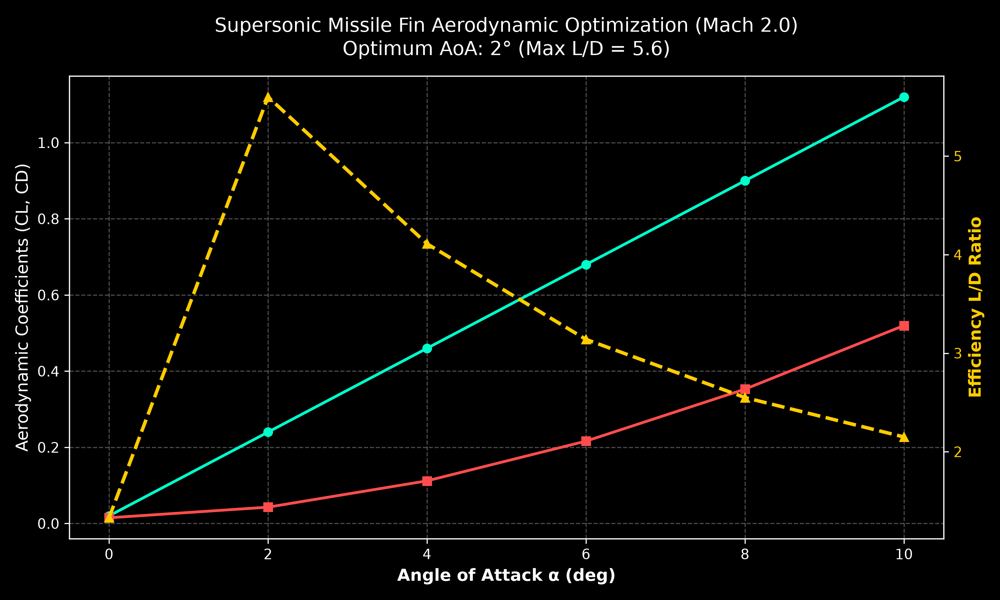

# Supersonic Fin Aerodynamic Optimization (Mach 2.0)

Automated CFD analysis and aerodynamic optimization workflow for a supersonic missile control fin using Python and ANSYS Fluent batch execution.

## Project Overview

In supersonic flight regimes, aerodynamic coefficients ($C_L$, $C_D$) are heavily influenced by shock wave structures and angle of attack variations. Manual design iteration across multiple geometric and flow conditions is inefficient. 

This project establishes an automated Python pipeline that interacts with ANSYS Fluent via journal scripts to execute parametric runs, compute drag polar trends, and identify the optimal angle of attack ($\alpha$) for maximum aerodynamic efficiency ($L/D$).

## Technical Specifications

- **Flow Regime:** Supersonic (Mach 2.0)
- **Governing Equations:** Compressible Navier-Stokes / Euler formulations
- **Turbulence Model:** $k-\omega$ SST (Shock-Boundary Layer Interaction)
- **Primary Parameters:** Angle of Attack ($\alpha = 0^\circ \text{ to } 10^\circ$)
- **Key Metrics:** Lift Coefficient ($C_L$), Drag Coefficient ($C_D$), Aerodynamic Efficiency ($L/D$)

## Workflow & Automation Logic

1. **Parametric Execution:** Python script iteratively modifies flow angles and triggers ANSYS Fluent batch solver routines (`fluent_run.jou`).
2. **Data Extraction:** Automated parsing of force report files generated during solver iterations.
3. **Post-Processing:** Computes polar curves and generates high-resolution trend charts.

## Results & Optimization Output

### Key Findings:
- **Maximum L/D Ratio:** Peak efficiency ($L/D \approx 5.6$) occurs at $\alpha = 2^\circ$.
- **Wave Drag Penalty:** Beyond $\alpha = 4^\circ$, supersonic wave drag dominates, leading to a steep decline in overall aerodynamic efficiency despite increasing lift.

## Repository Structure

- `opt_script.py`: Main Python automation, optimization, and plotting script.
- `fluent_run.jou`: ANSYS Fluent journal file for batch execution.
- `optimization_results.png`: Exported aerodynamic performance chart.

## How to Run

1. Clone the repository:
1. Clone the repository:
   `git clone github.com/bartuefeerturk/ansys-fluent-python-automation.git`
